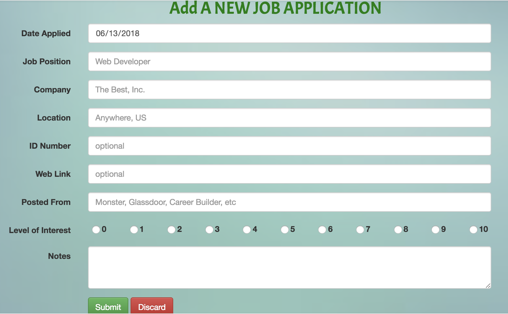

# Job-Tracker-2.0 #

**Table of Contents**
- [Intro / About Job Tracker](#intro)
- [Sign Up](#signup)
- [Sign In](#signin)
- [Menu](#menu)
- [Viewing all Entered Applications](#jobs)
- [Entering a New Application](#new)
- [Settings](#settings)
- [Thank You!](#thankyou)

To start tracking your career, please click on **https://job-tracker-career.herokuapp.com/**

## Introduction / About Job Tracker ##
Have you ever wondered how, why, of if you should keep track of the job applications you've filled out?  If you have ever filled out a lot, or sent in a lot, then this app can most certainly help you.

Just imagine these scenarios: :anguished:
- You wonder, have I already applied here before?  If so, when?  And what happened?
- You get a call about an application you've sent out, but cannot remember applying.
- You applied to a job, and had a friend recommend you, but you aren't sure which friend it was.
- You have to report places you've applied to while on Unemployment.  How to I gather all that information?
- You want to do more with your favorite applications, but wish there was a way to keep track of your favorite places.

:scream_cat: **YIKES** :scream:

Well, now with Job Tracker, you won't have to worry about any of these situations.  Not only does it make you look :poop: bad, but it also can hurt your chances of landing that job.

Job Tracker can do it all.  It will remember your applications and store any notes you want.  It keeps the links of places you've applied, and you can easily sort through all applications with a simple click.

:collision: **Insider Knowledge** :collision: - If you get called out of the blue about an application, ask if you can call them right back.  Then, log into Job Tracker, view the application, look at any notes you have, and click on the link to refresh you about the applicaion.  Then call the person back, and you will sound like a champ with all the knowledge you gained through the app. :clap:

Also, you can :rocket: export all of your data to a pdf, csv, excel, copy it to the clipboard, or print it directly from the site.

But first, you must [sign up :clipboard:](#signup) to get started.

:top:[Go to TOP](#top)

## Sign Up ##

Filling out this information will allow you access to the full site, allowing you to save and export data.  Your password is fully encrpyted using [Passport.js](http://www.passportjs.org/).

## Sign In ##
Forget your password?  No worries, just answer the security questions, and you can easily reset your password and get back in.

## Menu ##
Here you can go directly to your [:page_facing_up: Applications](#jobs), enter a [:card_index: New Application](#new), [:link: Adjust Settings](#settings), or log out.

## All of Your Applications ##

Here you will find a complete list of every application you have applied for.  The columns are sortable by simply clicking on one. Click on the same column again to sort in the opposite direction (ascending/descending).

To edit a row, click on the Edit icon on that row.

If you received information about an application, you can click the Employer's Response icon on that row.  That will open another window allowing you to enter what was said, and to mark the application as Active or Inactive.

Click on the arrow (:arrow_heading_down:) to the left of the row to see more details about the application. Click it (:arrow_heading_up:) again to close.

Click on the search bar at top to search through the table.

At the bottom, you can export this information through a variety of ways. PDF, CSV, EXCEL, COPY (to clipboard), and PRINT.

You can hide/show columns at your leisure.

*NOTE*: Rows that are red, mean they are past 28 days (customizable), and are colored that way to let you know it's been a while since you've applied.  You can click on the link to see if the position is open or closed, and mark your application as such.

## Enter a New Application ##

Here you can fill out what you want to about a job application.  The date, title, company, location, and interest level are required fields.  Everything else is left to your discretion.

## Settings ##
Here you can customize your experience further.

**Sound Effects** :sound::mute: - Turn Off or On.  (Currently the only sounds happen when you submit a new application, get a good response from an employer, or get a bad response from them)

**Alert for Overdue Application** :exclamation: - These are the number of days past the date you entered an application.  When an application goes past this, it will turn red, alerting you it's an older appliction.  Number must be from 1 - infinity.

**Order By** :arrow_double_down::arrow_double_up: - Each time you view the Applications page, it will be ordered by either Date or Interest Level.

**Sort By** :twisted_rightwards_arrows: - Each time you view the Applications page, the column chosen above (Date or Interest Level), will be sorted by Ascending order or Descending order.
I.E. - To view them by the oldest to the newest date, select Date (order by), and Ascending.
I.E. - To view by your highes interest level, select Interest level (order by), and Descending.

**Default display length** :arrow_up_down: - Each time you view the Applications page, it wil displey the first 5, 10, 15, 25, or all.

**Display/Hide Columns** :dizzy_face::flushed: - When you Hide a column, it makes it easier to view on a mobile device.  NOTE: Any column hidden, the information can still be viewed by clicking on the arrow button on the corresponding row.

**Change the name displayed at Top** :stuck_out_tongue_winking_eye: - This will change your name as it is shown at the top.  Change it to something Funny to make you smile each time you load up the application.

Make sure to **SAVE** :floppy_disk: the changes.  These are remembered every time going forward.

## ##

**THANK YOU** :thumbsup: for using this application, and please let me know any feedback or problems/bugs you might encounter.  Of course positive comments are welcomed as well.  I can be reached at **stuart_schafer@hotmail.com**.  Enjoy and GOOD LUCK!

**https://job-tracker-career.herokuapp.com/**